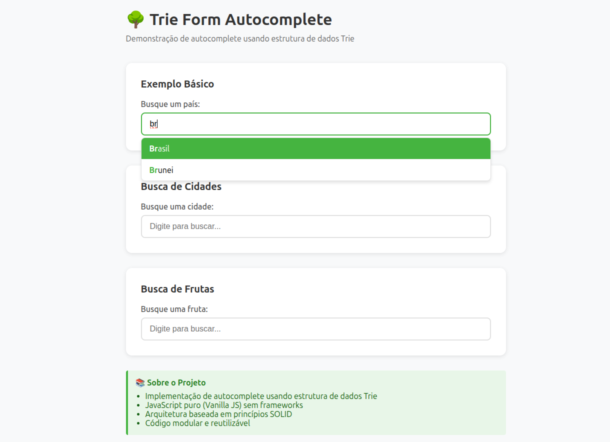

# Trie Form Autocomplete

Sistema de autocomplete para formulários HTML utilizando a estrutura de dados **Trie (Árvore de Prefixos)**, implementado em JavaScript puro seguindo princípios SOLID e boas práticas de arquitetura de software.

<div align="center">
  
</div>

## Sobre as Tecnologias Utilizadas

Este projeto é uma implementação educacional focada em:
- Prática de estruturas de dados (Trie)
- Aplicação de princípios SOLID
- Arquitetura modular e escalável
- JavaScript vanilla (sem frameworks)
- NPM para instalar dependências
- Vitest para a realização de testes unitários

## Arquitetura do Projeto

### Estrutura de Diretórios

```
trie-form-autocomplete/
├── src/                      # Código fonte
│   ├── core/                 # Estruturas de dados core
│   │   └── Trie.js          # Implementação da Trie
│   ├── services/             # Camada de serviços
│   │   ├── DataService.js   # Gerenciamento de dados
│   │   └── SearchService.js # Lógica de busca
│   ├── components/           # Componentes UI
│   │   ├── AutocompleteInput.js  # Componente principal
│   │   └── SuggestionList.js     # Lista de sugestões
│   ├── utils/                # Utilitários
│   │   ├── DOMUtils.js      # Helpers DOM
│   │   └── Validator.js     # Validações
│   ├── config/               # Configurações
│   │   └── constants.js     # Constantes do projeto
│   └── main.js              # Entry point
├── css/                      # Estilos
│   └── styles.css           # Estilos do componente
├── examples/                 # Exemplos de uso
│   └── basic-example.html
├── index.html               # Página principal (GitHub Pages)
├── package.json
├── .gitignore
├── README.md
├── ARCHITECTURE.md          # Documentação da arquitetura
└── IMPLEMENTATION_GUIDE.md  # Guia de implementação
```

## Princípios SOLID Aplicados

### 1. **Single Responsibility Principle (SRP)**
Cada classe/módulo tem uma única responsabilidade:
- `Trie.js`: Apenas lógica da estrutura de dados
- `DataService.js`: Apenas gerenciamento de fontes de dados
- `SearchService.js`: Apenas coordenação de buscas
- `AutocompleteInput.js`: Apenas interação com usuário
- `SuggestionList.js`: Apenas renderização da lista

### 2. **Open/Closed Principle (OCP)**
- Componentes abertos para extensão via configuração
- Fechados para modificação da lógica core
- Permite customização sem alterar código base

### 3. **Liskov Substitution Principle (LSP)**
- Interfaces bem definidas
- Contratos claros entre componentes
- Substituição de implementações sem quebrar funcionalidade

### 4. **Interface Segregation Principle (ISP)**
- Interfaces específicas e focadas
- Componentes não dependem de métodos que não usam
- API pública limpa e objetiva

### 5. **Dependency Inversion Principle (DIP)**
- Componentes dependem de abstrações
- Injeção de dependências via construtor
- Acoplamento fraco entre módulos

## Componentes Principais

### Core Layer

#### `Trie.js`
Implementação da estrutura de dados Trie (Árvore de Prefixos).
- Inserção de palavras: O(m) onde m é o tamanho da palavra
- Busca por prefixo: O(p + n) onde p é o tamanho do prefixo e n é o número de resultados
- Espaço: O(ALPHABET_SIZE × N × M) onde N é número de palavras e M é tamanho médio

### Service Layer

#### `DataService.js`
Gerencia fontes de dados:
- Carregamento de arrays estáticos
- Fetch de APIs externas
- Leitura de arquivos locais
- Abstração da origem dos dados

#### `SearchService.js`
Coordena operações de busca:
- Interface com a Trie
- Cache de resultados
- Aplicação de filtros
- Ordenação e limitação de resultados

### Component Layer

#### `AutocompleteInput.js`
Componente principal que gerencia:
- Event listeners (input, keyboard, focus)
- Debounce de buscas
- Navegação por teclado
- Callbacks e eventos customizados

#### `SuggestionList.js`
Gerencia a lista de sugestões:
- Renderização de itens
- Seleção e navegação
- Highlight de texto correspondente
- Posicionamento e visibilidade

### Utils Layer

#### `DOMUtils.js`
Funções auxiliares para DOM:
- Criação de elementos
- Cálculo de posições
- Highlight de texto
- Debounce e throttle

#### `Validator.js`
Validações e sanitização:
- Validação de entrada
- Sanitização de strings
- Normalização de texto
- Validação de configurações

## 🚀 Como Usar

### Instalação

```bash
# Clone o repositório
git clone https://github.com/seu-usuario/trie-form-autocomplete.git

# Entre no diretório
cd trie-form-autocomplete

# Inicie um servidor local para desenvolvimento
npm run dev

# Ou simplesmente abra o index.html no navegador
# (módulos ES6 requerem servidor HTTP)
```

### Demo Online

Acesse a demo no GitHub Pages: `https://seu-usuario.github.io/trie-form-autocomplete/`

### Uso Básico

```javascript
import TrieAutocomplete from './src/main.js';

// Criar autocomplete com array de dados
const autocomplete = TrieAutocomplete.create('#meu-input', {
    data: ['Maçã', 'Manga', 'Melancia', 'Morango'],
    minChars: 2,
    maxResults: 10
});
```

### Configurações Disponíveis

```javascript
{
    minChars: 2,              // Mínimo de caracteres para busca
    maxResults: 10,           // Máximo de resultados
    debounceDelay: 300,       // Delay para debounce (ms)
    highlightMatch: true,     // Destacar texto correspondente
    caseSensitive: false,     // Busca case-sensitive
    autoFocus: true,          // Auto-focar primeiro resultado
    closeOnBlur: true,        // Fechar ao perder foco
    closeOnSelect: true       // Fechar ao selecionar
}
```

## Complexidade dos Algoritmos

### Operações da Trie
- **Inserção**: O(m) - m = comprimento da palavra
- **Busca**: O(m) - m = comprimento da palavra buscada
- **Busca por Prefixo**: O(p + n) - p = comprimento do prefixo, n = número de resultados
- **Espaço**: O(ALPHABET_SIZE × N × M) - N = número de palavras, M = comprimento médio

### Otimizações Implementadas
- Cache de buscas recentes
- Debounce para reduzir buscas desnecessárias
- Renderização em lote para grandes conjuntos
- Event delegation para performance

## Customização de Estilos

Os estilos podem ser customizados através das classes CSS definidas em `constants.js`:

```css
.autocomplete-container
.autocomplete-input
.autocomplete-list
.autocomplete-item
.autocomplete-item--selected
.autocomplete-highlight
```

## Testes

O projeto utiliza **Vitest** para testes unitários. Todos os componentes principais possuem cobertura de testes.

### Instalação

```bash
# Instalar dependências (incluindo dependências de teste)
npm install
```

### Executar Testes

```bash
# Executar testes em modo watch (observa mudanças)
npm test

# Executar testes uma vez (sem watch)
npm run test:run

# Executar testes com interface gráfica
npm run test:ui

# Executar testes com relatório de cobertura
npm run test:coverage
```

### Estrutura de Testes

Os testes estão organizados seguindo a mesma estrutura do código fonte:

```
tests/
├── core/
│   └── Trie.test.js          # Testes da estrutura Trie
├── utils/
│   ├── Validator.test.js     # Testes de validação
│   └── DOMUtils.test.js      # Testes de manipulação DOM
├── services/
│   ├── DataService.test.js   # Testes do serviço de dados
│   └── SearchService.test.js # Testes do serviço de busca
└── components/
    ├── SuggestionList.test.js    # Testes da lista de sugestões
    └── AutocompleteInput.test.js # Testes do componente principal
```

### Cobertura de Testes

Os testes cobrem:
- ✅ **Core**: Trie (insert, search, contains, remove)
- ✅ **Utils**: Validator, DOMUtils
- ✅ **Services**: DataService, SearchService
- ✅ **Components**: SuggestionList, AutocompleteInput

### Documentação Completa

Para mais detalhes sobre os testes, consulte [`tests/README.md`](tests/README.md).

## 🤝 Contribuindo

Este é um projeto educacional. Sinta-se livre para fazer fork e experimentar!

## 📄 Licença

MIT License - sinta-se livre para usar em seus projetos.

## 👨‍💻 Autor

Lucas de Godoy Chicarelli

Projeto desenvolvido para prática de estruturas de dados e princípios SOLID.